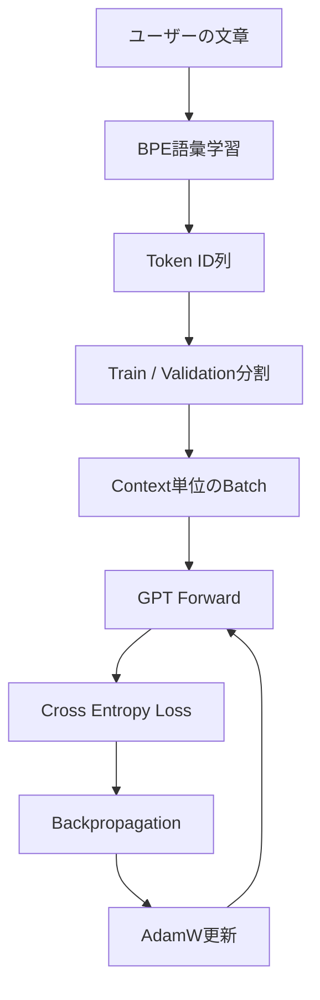

# Architecture

## 学習パイプライン

すべての学習対象はローカルです。BPEはUnicode文字から始め、隣接Tokenの頻度が最も高いペアを反復的に結合します。GPTは正解Tokenを一つ右へずらした教師ありの次Token予測で学習します。

## GPTブロック

各TransformerブロックはPre-LayerNorm構成です。

1. `LayerNorm → Multi-Head Causal Self-Attention → Residual`
2. `LayerNorm → Linear(4d) → GELU → Linear(d) → Residual`

Attention scoreは次式です。

\[
\mathrm{Attention}(Q,K,V)=\mathrm{softmax}\left(\frac{QK^T}{\sqrt{d_k}}+M\right)V
\]

`M`は未来Tokenを負の無限大へマスクする下三角の因果マスクです。そのため、学習時にも現在位置より先の正解を覗けません。

## 可視化の意味

- **Train Loss**: 現在Batchで正解Tokenへ割り当てた確率の負の対数尤度。
- **Validation Loss**: 重み更新に使わないデータで測った損失。過学習の発見に使います。
- **Perplexity**: `exp(validation loss)`。候補を平均何通りに迷っているかの目安です。
- **Gradient norm**: 全パラメータの勾配の大きさ。設定値を超えた場合はclipします。
- **Attention heatmap**: 行のTokenが列のどの過去Tokenを参照したか。GUIでは最終層のHead平均です。

## GPU

`auto`はCUDA、MPS、CPUの順で選択します。CUDAでは自動混合精度とGradScalerを使用し、AdamWが対応していればfused実装を使います。モデル・Batch・入力Tokenは同じデバイスへ移されます。

## Checkpoint

`.pt`ファイルには次を保存します。

- モデル構成と重み
- BPE語彙とmerge規則
- Optimizer状態
- 学習設定、現在Step、可視化履歴

これにより、学習済みモデルとトークナイザーの対応を崩さず文章生成へ再利用できます。

